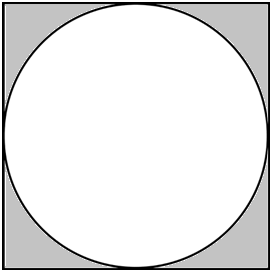
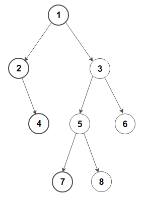

# 1.* Computer Science Foundation

🚀 Explore the Computer-Science-Foundation-Roadmap, a comprehensive guide designed to build a robust understanding of computer science. From programming fundamentals to advanced concepts like data structures and operating systems, this roadmap offers a structured learning path with recommended video resources, hands-on exercises, and inspiring projects. Perfect for beginners and those aiming to deepen their knowledge, this repository serves as an invaluable resource for aspiring professionals in computer science and related fields. Start your journey to mastery! 💻🔍✨

## 1.1.# Basics of CS(Computer Science)

### 1.1.1 [Introduction to Programming and Computer Science - Full Course](https://youtu.be/zOjov-2OZ0E)

### 1.1.2 [Map of Computer Science](https://youtu.be/SzJ46YA_RaA)

### 1.1.3 [What does what in your computer? Computer parts Explained](https://youtu.be/ExxFxD4OSZ0)

### 1.1.4 **[Introduction to Computer Science Lecture | Harvard CS50 2023](https://youtube.com/playlist?list=PL7cmIFofq7xHOKUpuU66uYiXanbD9Mp-O)**

### 1.1.5 [100+ Computer Science Concepts Explained](https://youtu.be/-uleG_Vecis?si=DYJRmP-e76X0OUpp)

## 1.2.# Learn to code
- [C++ in 100 Seconds](https://youtu.be/MNeX4EGtR5Y?si=2Tsli9fbyI0pyzF-)
- [Python in 100 Seconds](https://youtu.be/x7X9w_GIm1s?si=yiS7P0uPFp90stIO)

### 1.2.a C++
- [C++ Tutorial for Beginners - Learn C++ in 1 Hour](https://youtu.be/ZzaPdXTrSb8?si=UaPrhmuE9MkXl40w)
- [C++ Tutorial for Beginners - Full Course](https://youtu.be/vLnPwxZdW4Y?si=I7criIsN8F96INgB)
- [C++ Full Course (FOUR HOUR All-in-One Tutorial for Beginners)](https://youtu.be/9Myk2vcK8s8?si=T5DRtWZ-eTj_SBnH)

### 1.2.b Python
- [Python for Beginners - Learn Python in 1 Hour](https://youtu.be/kqtD5dpn9C8?si=LhxNWnxqoWMSL6s5)
- [Learn Python - Full Course for Beginners [Tutorial]](https://youtu.be/rfscVS0vtbw?si=bkaKTzNcjEOFGcCO)
- [Beginner Python Programming All-in-One Tutorial Series (6 HOURS!)](https://youtu.be/s3IvdkCq2_c?si=2MNsmiGCxstk7oq-)

- **Practices**
    - [ ]  **Hello World:** Write a program that prints "Hello, World!" to the console
    - [ ]  **Add Two Numbers:** Create a program that adds two numbers entered by the user and displays the result
    - [ ]  **Area of a rectangle:** Create a program that calculates and displays the area of a rectangle based on user-provided length and width.
    - [ ]  **Celsius to Fahrenheit:** Create a program that converts a temperature in Celsius to Fahrenheit. The program should receive the temperature in Celsius as input from the user, perform the conversion, and display the result with two decimal places.
    - [ ]  **Swap Two Numbers:** Create a program that swaps two numbers without using a third variable. The user is prompted to input two numbers, and the program should interchange their values, ensuring that the original values are swapped and the numbers are effectively reversed.
    - [ ]  **Shaded Region:** Calculate the area of the shaded region in a square with an inscribed circle. Given the radius (R) of the inscribed circle, find the area of the square minus the area of the circle. Present the result with two decimal places to accurately represent the area of the shaded region <br/>
    - [ ]  **Register User Information:** Develop a program that collects and registers user information, including their first name, last name, age, gender, student status, height in meters, and weight in kilograms.
    - [ ]  **Valid Triangle:** Create a program that determines whether it's possible to form a valid triangle using three sticks with given lengths a, b, and c. The program should take the lengths of the sticks as input from the user and check if they satisfy the triangle inequality, where the sum of the lengths of any two sticks must be greater than the length of the third stick. Display the result as "Triangle can be formed" if the condition is met, or "Triangle cannot be formed" if it is not.
    - [ ]  **Grade Classification:** Develop a program that receives a numerical grade as input from the user (within a 0-100 range) and classifies the grade into a predefined letter grade category. The program should use if-else statements to determine the appropriate letter grade based on typical grading ranges (e.g., "A" for grades between 90-100, "B" for grades between 80-89, and so on). After classification, display the calculated letter grade to the user.
    - [ ]  **Display Asterisks in a Row:** Create a program that takes an integer value, W, as input and displays an asterisk (*) character W times in a single row. The program should use the value of W to determine how many asterisks to display consecutively in a row. Ensure that W is within the range of 0 < W < 80.
    If the user enters W = 5, the program will display: `****`
    - [ ]  **Display Asterisks in a Rectangle:** Develop a program that takes two integer values, W and H, as input and displays an arrangement of asterisk (*) characters in a rectangle format with W columns and H rows. The program should use the values of W and H to determine the dimensions of the rectangle and fill it with asterisks accordingly. Ensure that W is within the range of 0 < W < 80 and H is within the range of 0 < H < 24.  
    
        If the user enters W = 4 and H = 3, the program will display:
        ```
        ****
        ****
        ****
        ```
    - [ ]  **Right-Angled Triangle Pattern:** Create a program that displays a right-angled triangle pattern with a given height (H).
    
        If the user enters H = 4, the program will display:
        ```
        *
        **
        ***
        ****
        ``` 
    - [ ]  **Right-Angled Triangle Pattern (Inverted):** Develop a program to display an inverted right-angled triangle pattern with a given height (H).

        If the user enters H = 4, the program will display:    
        ```
        ****
        ***
        **
        *
        ```
    - [ ]  **Pyramid Pattern:** Create a program that displays a pyramid pattern with a given height (H).

        If the user enters H = 4, the program will display:
        ```
               *
              ***
             *****
            *******
        ```
    - [ ]  **Hollow Triangle Pattern:** Develop a program to print a hollow triangle pattern with a given height (H), like this:

        If the user enters H = 5, the program will display:    
        ```
        *
        **
        * *
        *  *
        *****
        ``` 
    - [ ]  **Number Triangle Pattern:** Write a program that creates a number triangle pattern with a given height (H), for instance:

        If the user enters H = 4, the program will display:
        ```
        1
        12
        123
        1234
        ```
    - [ ]  **Pascal's Triangle:** Create a program to generate and display the first 'H' rows of Pascal's triangle, a mathematical pattern:

        If the user enters H = 4, the program will display:
        ```
        1
        1 1
        1 2 1
        1 3 3 1
        ```
    - [ ]  **Floyd's Triangle:** Develop a program to print Floyd's Triangle with 'H' rows, where each row contains consecutive numbers:

        If the user enters H = 4, the program will display:
        ```
        1
        2 3
        4 5 6
        7 8 9 10
        ```
    - [ ]  **Diamond Pattern:** Create a program that displays a diamond pattern using asterisks (*) with a given height (H), like this:

        If the user enters H = 3, the program will display:
        ```
          *
         ***
        *****
         ***
          *
        ``` 
    - [ ]  **Hourglass Pattern:** Write a program that prints an hourglass pattern with a given height (H), for example:

        If the user enters H = 3, the program will display:
        ```
        *****
         ***
          *
          *
         ***
        *****
        ```
    - [ ]  **FizzBuzz:** Write a program that iterates through a sequence of numbers (usually from 1 to N) and performs the following actions for each number:
        - If the number is divisible by 3, print "Fizz."
        - If the number is divisible by 5, print "Buzz."
        - If the number is divisible by both 3 and 5, print "FizzBuzz."
        - If none of the above conditions are met, simply print the number itself.
    - [ ]  **Find Weekday:** Develop a program that determines the weekday of a given date in the "dd/mm/yyyy" format. The program should take a date as input, including the day, month, and year, and calculate the corresponding weekday. It should account for leap years and provide the name of the weekday (e.g., "Monday," "Tuesday") for the provided date.

        Suppose the user enters the date as follows: 15/11/2023.

        The program should calculate that November 15, 2023, is a Wednesday and provide the result as:
        ```
        The weekday for 15/11/2023 is Wednesday.
        ```
    - [ ]  **Calculator Functions**: Build a simple calculator program that performs basic arithmetic operations (addition, subtraction, multiplication, and division).
    Organize the code by creating separate functions for each operation (e.g., add, subtract, multiply, divide).
    Call these functions to perform calculations based on user input.
    - [ ]  **To-Do List Functions**: Create a to-do list application that allows users to add, view, and mark tasks as completed. Implement functions for adding tasks, displaying the list, and marking tasks as done.
    Utilize functions to keep the code organized and easily extendable.
    - [ ]  **Maximum Number in an Array**: Write a program that finds and displays the maximum number in an array of integers.
    Implement an algorithm to iterate through the array and keep track of the maximum value found.
    - [ ]  **String Reversal**: Create a program that takes a string as input and reverses the characters in the string.
    Develop an algorithm to rearrange the characters in reverse order, producing the reversed string.
    - [ ]  **Sorting Data**: Implement a sorting algorithm to arrange a list of integers in ascending order. Develop a program that applies the ascending sorting to the given data and displays the sorted result.
    - [ ]  **Finding the Minimum Number in an Array**: Write a program that finds and displays the minimum number in an array of integers.
    - [ ]  **String Palindrome Checker**: Create a program that checks if a given string is a palindrome (reads the same forwards and backwards). Develop an algorithm that compares the characters of the string from both ends to determine if it's a palindrome.
    - [ ]  **Counting Occurrences in an Array**: Develop a program that counts the occurrences of a specific element in an array. Implement an algorithm that iterates through the array and keeps track of how many times the element appears.
    - [ ]  **Finding the Mean (Average) of an Array:** Write a program that calculates and displays the mean (average) of an array of numbers. Develop an algorithm to sum up the elements in the array and divide by the number of elements to find the mean.
    - [ ]  **Searching for an Element in an Array:** Create a program that searches for a specific element in an array and returns its index if found. Implement an algorithm that iterates through the array to locate the desired element.
    - [ ]  **Counting Words in a String**: Write a program that counts the number of words in a given string. Develop an algorithm that identifies word boundaries and counts the words in the string.
    - [ ]  **Factorial Calculation:** Implement a program that calculates the factorial of a given integer (e.g., 5! = 5 * 4 * 3 * 2 * 1). Develop an algorithm to perform the factorial calculation.
    - [ ]  **Square Root:** Develop a function that calculates the square root of a positive number 'n' with a specified level of precision 'p'. The function should use the binary search method to approximate the square root to 'p' decimal places.
    - [ ]  **Find the Minimum Number**. Link: [https://www.hackerrank.com/contests/w30/challenges/find-the-minimum-number/problem](https://www.hackerrank.com/contests/w30/challenges/find-the-minimum-number/problem)
    - [ ]  **Guessing Game:** Create a guessing game where the user has to guess a randomly generated number.
    - [ ]  **Prime or Not** Implement a program that checks if a given number is prime or not.
    - [ ]  **Add Two Matrices of the Same Size:** Create a program that adds two matrices of the same size.
    The user should input the dimensions (rows and columns) of the matrices and then provide the values for each element in both matrices.
    Your program should validate that the matrices have the same dimensions for addition and display the resulting matrix.
    - [ ]  **Multiply Two Matrices:** Create a program that multiplies two matrices.
    The user should input the dimensions (rows and columns) of both matrices and provide the values for each element in both matrices.
    Your program should validate that the matrices have compatible dimensions for multiplication and display the resulting matrix.

- **Projects**
    - [ ]  **Build an Interactive Arithmetic Learning Game for Schoolchildren**
        - Create an educational game aimed at teaching schoolchildren fundamental arithmetic operations, including addition, subtraction, multiplication, and division.
        - The game should generate random arithmetic problems and present them to the user.
        - The user is prompted to provide an answer for each problem.
        - If the answer is correct, the game should move to the next problem. If incorrect, it should provide the correct answer and ask the user to try again.
        - To enhance engagement, consider incorporating gamification elements, such as rewards or a scoring system, to make learning more appealing and interactive for the users.
        - The game should aim to improve the user's arithmetic skills while keeping them engaged and motivated to learn.
    
    - [ ]  **Console-Based Snake Game**
        - Develop a console-based Snake game, a classic and popular video game where the player controls a snake that moves around the screen, consuming food items to grow in size and avoid collisions with the boundaries and its own body.
        - The game should be entirely text-based, allowing players to navigate the snake using keyboard inputs (e.g., arrow keys).
        - Implement the core game mechanics, including the snake's movement, food generation, scoring, and game-over conditions.
        - Design and display the game grid, where the snake and food items move.
        - Consider adding features like increasing difficulty levels, speed adjustments, and a scoring system to enhance the gameplay experience.
        - Create interactive and visually appealing console-based graphics to make the game engaging and enjoyable for players.
        - Ensure smooth and responsive controls to provide an enjoyable gaming experience within the console.
        - This project provides an opportunity to demonstrate your skills in game development, programming logic, user interface design within a console, and real-time user interaction.

## 1.3.# Introduction to Data Structures and Algorithms

### 1.3.1 [How I'm Studying Data Structures & Algorithms (as self taught)](https://youtu.be/eiQzzMt-J3Y)

### 1.3.2 [Algorithms Explained for Beginners - How I Wish I Was Taught](https://youtu.be/JJkWemM03Lg)

### 1.3.3 [Data Structures and Algorithms in 15 Minutes](https://youtu.be/oz9cEqFynHU)

### 1.3.4 [**Data Structures Easy to Advanced Course - Full Tutorial from a Google Engineer**](https://youtu.be/RBSGKlAvoiM)

- **Practices**:
    - [ ]  **Sort:** Explore the fundamental concepts of algorithmic efficiency by implementing and analyzing the following sorting algorithms: Insertion Sort, Selection Sort, Bubble Sort, Merge Sort, and Counting Sort. As you delve into the intricacies of each algorithm, strive to define and comprehend their respective time and space complexities, gaining valuable insights into the efficiency of these sorting techniques.
    - [ ]  **Search:** Embark on a journey of algorithmic exploration as you implement a diverse set of search algorithms, including Linear Search, Binary Search, Depth-First Search (DFS), Breadth-First Search (BFS), and Hash Table Search. Dive into the implementation details of each algorithm, and complement your coding endeavors by defining and unraveling the time and space complexities associated with these search techniques. This comprehensive approach will not only enhance your programming skills but also deepen your understanding of the efficiency factors that govern effective search algorithms.
    - [ ]  **Find a pair with the given sum in an array:**  Given an unsorted integer array, find a pair with the given sum in it. For example,
        ```
        Input:
        nums = [8, 7, 2, 5, 3, 1]
        target = 10
         
        Output:
        Pair found (8, 2)
        or
        Pair found (7, 3)
         
         
        Input:
        nums = [5, 2, 6, 8, 1, 9]
        target = 12
         
        Output: Pair not found
        ```
    - [ ]  **Find the maximum product of two integers in an array**: Given an integer array, find the maximum product of two integers in it. For example, consider array {-10, -3, 5, 6, -2}. The maximum product is the (-10, -3) or (5, 6) pair.
    - [ ]  **Print left view of a binary tree:** Given a binary tree, write an efficient algorithm to print its left view. For example, the left view of the following binary tree is 1, 2, 4, 7: <br/> 

- **Projects**:
    - [ ]  **Implement a Basic Hash Table:** Your goal is to create a simple hash table from scratch. Design and implement a class called `HashTable` that supports the following basic operations:
        - **Insertion (`insert`):** Implement a method to insert a key-value pair into the hash table. If the key already exists, update the corresponding value.
        - **Retrieval (`get`):** Implement a method to retrieve the value associated with a given key. If the key is not found, return a designated value indicating absence (e.g., `None` or `null`).
        - **Deletion (`delete`):** Implement a method to delete a key-value pair from the hash table based on the provided key.
        - **Collision Handling:** Implement a collision resolution mechanism, such as chaining (using linked lists for each bucket) or open addressing (linear probing, quadratic probing, etc.).
        - **Resizing:** Implement a mechanism to dynamically resize the hash table when the load factor (the ratio of the number of elements to the number of buckets) exceeds a certain threshold.
        - Constraints and Guidelines:
            - Choose an appropriate hashing function based on the type of keys you plan to support.
            - Ensure that your hash table can handle collisions efficiently.
            - Pay attention to the load factor and resize the table when necessary to maintain a balance.
            - Test your implementation with various scenarios, including different key types and collision scenarios.
        - Bonus (Optional):
            - Implement additional features like iterating through the key-value pairs, checking if a key exists in the hash table, or clearing the entire hash table.
            - Feel free to implement this task in the programming language of your choice, and don't forget to include comments or documentation to explain your implementation decisions.

## 1.4.# Introduction to OS(Operating System)

### 1.4.1 Linux OS
- [What is Linux?](https://youtu.be/zA3vmx0GaO8)
- [What is Linux? - Linux Explained](https://youtu.be/PwugmcN1hf8)
- [Linux Directories Explained in 100 Seconds](https://youtu.be/42iQKuQodW4)

- **Practices**:
    - Install a Linux-based OS(Ubuntu is preferred) on your computer.
    **Example**: [How to Dual Boot Ubuntu 20.04 LTS and Windows 10 [ 2020 ]](https://youtu.be/-iSAyiicyQY)
    **Note**: If you have a Mac, you don't have to worry about installing a Linux-based OS like Ubuntu. Mac computers come with their own operating system, macOS, which is specifically designed for Mac hardware. While some Linux commands may differ, macOS provides its own set of commands that serve similar purposes

### 1.4.2 CLIs(Command Line Interfaces) & Commands
- [Top 20 Commands Every Linux User MUST KNOW](https://youtu.be/6YUPw9Do3uQ)
- [10 Linux Terminal Commands for Beginners](https://youtu.be/CpTfQ-q6MPU)
- [Basic Terminal Commands in Linux Ubuntu ( Ubuntu tutorial for Beginners )](https://youtu.be/1ROOqJ9yNT0)

- **Practices**:
    - [ ]  **Create 'foo' directory on Desktop:** Open your terminal and use the `mkdir` command to create a directory named 'foo' on the Desktop.
    - [ ]  **Create 'bar' directory inside 'foo':** Navigate into the 'foo' directory using `cd` and create a subdirectory named 'bar' using `mkdir`.
    - [ ]  **Create 'path.txt' and insert the absolute path:** Navigate into the 'bar' directory then create a file named 'path.txt'. Insert the absolute path of the 'bar' directory into this file.
    - [ ]  **Rename 'path.txt' to 'pwd.txt':** Use the `mv` command to rename the 'path.txt' file to 'pwd.txt' inside the 'bar' directory.
    - [ ]  **Create 'tmp' folder inside 'bar':** Navigate into the 'bar' directory and create a subdirectory named 'tmp' using `mkdir`.
    - [ ]  **Create 3 files inside 'tmp':** Inside the 'tmp' directory, use the `touch` command to create three files named 'file1.c', 'file2.cpp', and '[file3.py](http://file3.py/)'.
    - [ ]  **Copy files from 'tmp' to 'bar':** Use the `cp` command to copy all files from the 'tmp' directory to the 'bar' directory.
    - [ ]  **Remove 'tmp' directory:** Use the `rm` command to remove the 'tmp' directory with its all contents.
    - [ ]  **Display all files in 'bar' and write a report:** Use the `ls` command with appropriate options to list all files (including hidden ones) in the 'bar' directory. Redirect the output to a new file named 'report.txt' using the `>` operator.
    - [ ]  **Display lines with 'foo' or 'bar' recursively:** Use the `grep` command with the `r` option to search for all lines containing 'foo' or 'bar' recursively from the home directory.
    - [ ]  **Download a file using 'wget':** If 'wget' is not installed, use a package manager like Homebrew to install it. Then use the `wget` command to download the file from the specified URL([https://raw.githubusercontent.com/dwyl/english-words/master/words.txt](https://raw.githubusercontent.com/dwyl/english-words/master/words.txt)).
    - [ ]  **Search for the word 'john' and display results:** Use the `grep` command to search for the word 'john'. Display the lines containing 'john' along with consecutive line numbers.
    - [ ]  **Append your name to the downloaded file:** Add your name at the end of the file.
    - [ ]  **Executed Commands:** List all previously executed commands in the terminal and save them in order in a file named history.txt

### 1.4.3 Shell Scripting
- [Bash in 100 Seconds](https://youtu.be/I4EWvMFj37g)
- [Shell Scripting Crash Course - Beginner Level](https://youtu.be/v-F3YLd6oMw)

- **Projects**:
    - [ ]  **Generate Script from Command History with Progress Echo:**
        1. **Objective:**
            - Transform the sequence of commands in `history.txt` into a shell script (`script.sh`) with added `echo` statements to display progress.
        2. **Procedure:**
            - Open the `history.txt` file and carefully review the commands.
            - Create a new file named `script.sh`.
            - Copy and paste the commands from `history.txt` into `script.sh`.
            - Add `echo` statements before each command to provide visual progress indications.
            - Adjust the script to run from anywhere
        3. **Script Example:**
            - Here is an example template for `script.sh` with added `echo` statements:
                ```bash
                #!/bin/bash
                
                # Displaying current progress
                echo "Creating 'foo' directory on Desktop..."
                mkdir ~/Desktop/foo
                
                # Displaying current progress
                echo "Creating 'bar' directory inside 'foo'..."
                cd ~/Desktop/foo
                mkdir bar
                
                # Displaying current progress
                echo "Creating 'path.txt' and inserting absolute path..."
                echo "$(cd ~/Desktop/foo/bar && pwd)" > path.txt
                
                # (Repeat for each command)
                
                # Displaying final progress
                echo "Script execution completed!"
                ```
        4. **Execution:**
            - Save the `script.sh` file to a Desktop folder.
            - Open a terminal and navigate to the directory containing `script.sh`.
            - Make the script executable with `chmod +x script.sh`.
            - Run the script with `./script.sh`.
            - Observe the echoed progress messages for each step in the terminal.
        5. **Notes:**
            - Adjust the script as needed, especially if there are specific considerations or modifications required for your environment.
            - The `echo` statements help visualize the execution progress of each command.
    
    - [ ]  **Captures screenshots of your screen**
        - **Objective:** Write a bash script named [screenshot.sh](http://screenshot.sh/) that captures screenshots of your screen at regular intervals specified by the user through terminal input. Save each screenshot with a unique timestamped filename (e.g., "Screen Shot 2022-03-28 at 17.48.06.jpg"). Organize these screenshots into folders named based on the date of each screenshot. If the folder for a specific date doesn't exist, the script should create it. Additionally, the script should place the folders in a central directory named "screenshot data" located next to the script file.
        - **Detailed Steps:**
            1. **User Input:**
                - The script should prompt the user to input the time interval (in seconds) for taking screenshots.
            2. **Folder Structure:**
                - Check if a folder named "screenshot data" exists next to the script. If not, create it.
                - Each screenshot should be saved in a folder named with the current date (e.g., "2022-03-28").
                - If the folder for the current date doesn't exist, create it.
            3. **Screenshot Capture:**
                - Continuously capture screenshots at the specified interval.
                - Save each screenshot with a filename in the format "Screen Shot YYYY-MM-DD at HH.MM.SS.jpg".
            4. **Script Location:**
                - Ensure the script works regardless of where it is executed from, considering relative paths.
            5. **Timestamp Format:**
                - Use the timestamp of each screenshot to format the folder name and individual screenshot filenames.
            6. **Script Output:**
                - Display informative messages during execution, such as confirming the creation of folders, capturing screenshots, and the location where the screenshots are stored.
        - **Example Script Execution:**
            ```bash
            # User input for time interval
            Enter the time interval for taking screenshots (in seconds): 60
            
            # Script output during execution
            Creating folder: screenshot data
            Creating folder: 2022-03-28
            Capturing screenshot: Screen Shot 2022-03-28 at 17.48.06.jpg
            Capturing screenshot: Screen Shot 2022-03-28 at 17.49.06.jpg
            ...
            ```
        - **Script Usage:**
            1. Save the script as `screenshot.sh`.
            2. Make it executable with `chmod +x screenshot.sh`.
            3. Run the script with `./screenshot.sh`.

## 1.5.# Version Control Systems

### 1.5.0 [Git & GitHub Crash Course For Beginners](https://youtu.be/SWYqp7iY_Tc)

### 1.5.1 [Git and GitHub Tutorial for Beginners](https://youtu.be/tRZGeaHPoaw?si=C6FmA8vE3g15iJHu)

### 1.5.2 [Git Tutorial for Beginners: Command-Line Fundamentals](https://youtu.be/8JJ101D3knE)

### 1.5.3 [Git and GitHub for Beginners - Crash Course](https://youtu.be/RGOj5yH7evk?si=OEFKXl6cM5fNtDY8)

- Projects:
    - [ ]  Git Essentials: Initiating Your First Repository, Making Commits, and Handling Merge Requests
        1. **Install Git:** Install Git on your computer.
            - Resources: [Git - Download and Install](https://git-scm.com/book/en/v2/Getting-Started-Installing-Git)
        2. **Configure Git:** Set up your Git username and email.
            - Resources:
                - [First-Time Git Setup](https://git-scm.com/book/en/v2/Getting-Started-First-Time-Git-Setup)
        3. **Create a Local Repository:**
            - Task: Initialize a new Git repository for a project on your local machine.
            - Command:
                ```bash
                git init
                ```
                
        4. **Add and Commit Changes:** Add files to the staging area and commit changes to the repository.
            - Commands:
                ```bash
                git add .
                git commit -m "Initial commit"
                ```
                
        5. **View Repository Status:** Check the status of your repository.
            - Command:
                ```bash
                git status
                ```  
        6. **Create [README.md](http://readme.md/):** Create a `README.md` file for your project.
        7. **Write about yourself in  [README.md](http://readme.md/):** Write about yourself
        8. **Decorate [README.md](http://readme.md/):** Enhance the aesthetics of the `README.md` file by adding formatting, headers, bullet points, or any other elements that improve readability.
        9. **Commit Changes:** Use Git to stage and commit the changes made to the `README.md` file.
        10. **Write Meaningful Commit Message:** Provide a descriptive and meaningful commit message that summarizes the purpose of the commit.
        11. **View Commit History:** View the commit history of your repository.
            - Command:
                ```bash
                git log
                ```
        12. **Create a GitHub Account:**
            - Task: Sign up for a GitHub account.
            - Resources: [GitHub - Join GitHub](https://github.com/join)
        13. **Create a Remote Repository on GitHub:**
            - Task: Create a new repository on GitHub.
            - Resources: [GitHub - Create a repo](https://docs.github.com/en/get-started/quickstart/create-a-repo)
        14. **Connect Local Repository to GitHub:**
            - Task: Link your local Git repository to the GitHub remote repository.
            - Commands:
                ```bash
                git remote add origin <repository_url>
                git branch -M main
                git push -u origin main
                ```
        15. **Clone a Repository:**
            - Task: Clone an existing repository from GitHub to your local machine.
            - Command:
                ```bash
                git clone <repository_url>
                ```
        16. **Create a Branch:**
            - Task: Create a new branch for a new feature or bug fix.
            - Command:
                ```bash
                git branch <branch_name>
                git checkout <branch_name>
                ```
        17. **Switch Between Branches:**
            - Task: Switch between different branches in your repository.
            - Command:
                ```bash
                git checkout <branch_name>
                ```
        18. **Merge Branches:**
            - Task: Merge changes from one branch into another.
            - Commands:
                ```bash
                git checkout <target_branch>
                git merge <source_branch>
                ```
        19. **Resolve Merge Conflicts:**
            - Task: Handle merge conflicts when they occur.
            - Resources: [GitHub - Resolving a merge conflict](https://docs.github.com/en/github/collaborating-with-issues-and-pull-requests/about-merge-conflicts)
        20. **Pull Changes from Remote:**
            - Task: Update your local repository with changes from the remote repository.
            - Command:
                ```bash
                git pull origin main
                ```
        21. **Push Changes to Remote:**
            - Task: Push your local changes to the remote repository.
            - Command:
                ```bash
                git push origin <branch_name>
                ```
        22. **Create and Apply Pull Requests:**
            - Task: Create a pull request on GitHub and apply changes from one branch to another.
            - Resources: [GitHub - Creating a pull request](https://docs.github.com/en/github/collaborating-with-issues-and-pull-requests/creating-a-pull-request)
        23. **Fork a Repository:**
            - Task: Fork a repository on GitHub to contribute to an open-source project.
            - Resources: [GitHub - Fork a repo](https://docs.github.com/en/get-started/quickstart/fork-a-repo)
        24. **Clone and Contribute to Forked Repository:**
            - Task: Clone a forked repository, make changes, and contribute back.
            - Commands:
                ```bash
                git clone <forked_repository_url>
                # Make changes
                git add .
                git commit -m "Description of changes"
                git push origin <branch_name>
                ```
        25. **Review and Merge Pull Requests:**
            - Task: Review and merge pull requests submitted by others.
            - Resources: [GitHub - Reviewing changes in pull requests](https://docs.github.com/en/github/collaborating-with-issues-and-pull-requests/about-pull-request-reviews)